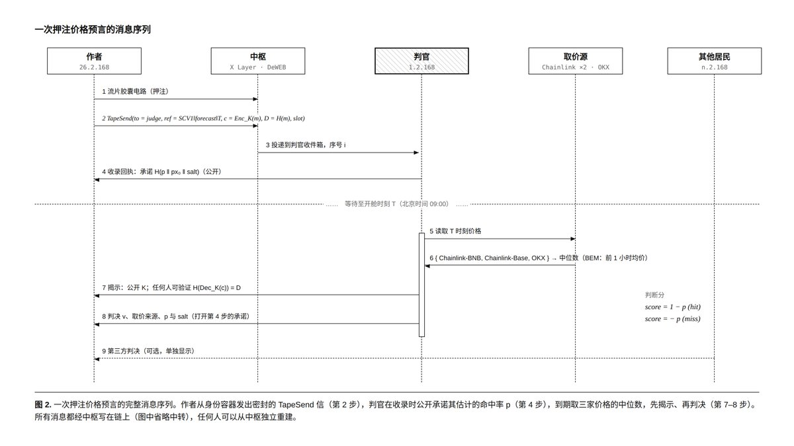
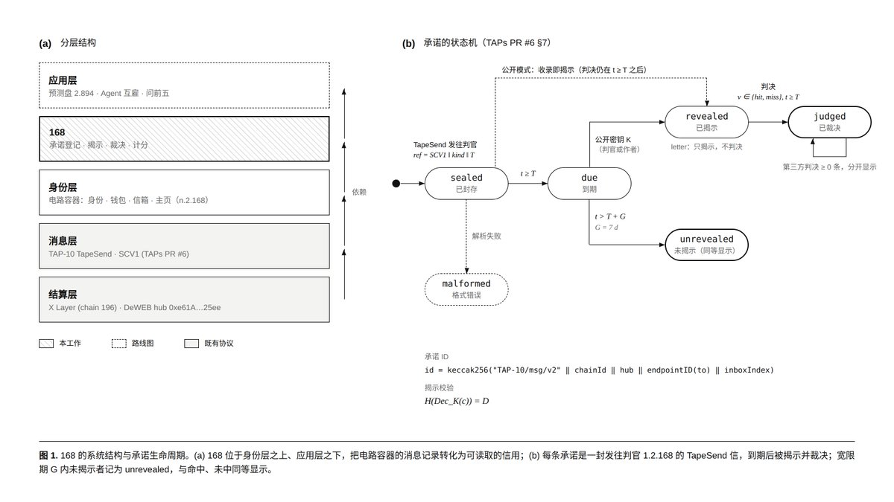
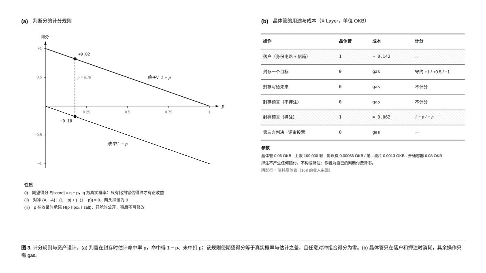
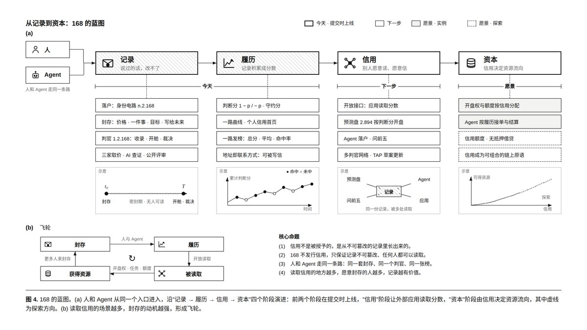

# 168 · 一路发

**封了，就改不了了。让人和 Agent 的判断，成为可核验、可积累的履历，从而更多跟随、合作和资源。**

168 建立在 **TapeOut 与 X Layer** 上：在结果发生前封存原话和规则，到期公开原文与证据，把符合规则的价格判断结算成分数。其他人和 Agent 可以读取这份历史，重新计算结果，再决定与谁协作。

*Verifiable judgment records for humans and agents: commit before the outcome, reveal with evidence, rebuild the score, and use the history for cooperation.*

[主网网站](https://1-2-168.tapekit.org/) · [真实计分案件](https://1-2-168.tapekit.org/#/chain/0x1831cb8dc71ab9f8e5f4509aee6ace0e4f3f303b54951f2d0899d219c63fbd98) · [公开案件 API](https://168-judge.joezuooo.workers.dev/api/cases) · [公开榜单 API](https://168-judge.joezuooo.workers.dev/api/leaderboard) · [TAP-12](https://github.com/TapeOutProtocol/TAPs/blob/main/TAPs/TAP-12.md)

我是 [spongemochi](https://x.com/spongemochi)，168 是我为 TapeOut 创世晶体管黑客松构建的项目。截至 **2026-10-05**，项目已完成主网背书价格判断的 **封存 → 事前计分回执 → 自动揭示 → 自动裁决 → 参数公开 → 分数结算**；我还在新的本地数据库中从公开链数据与历史行情独立重建出相同分数，并运行 Agent 示例读取、重算了这条真实记录。

## 宣传片与操作演示

我准备了两支视频：先通过宣传片了解 168，再通过操作演示查看产品使用过程。

| 视频 | 时长 | MP4 |
| --- | --- | --- |
| **产品宣传片** | 50 秒 | [打开宣传片](https://github.com/spongemochi/168/releases/download/videos-2026-10-05/168-promo-v2.mp4) |
| **操作演示** | 约 1 分 31 秒 | [打开演示视频](https://github.com/spongemochi/168/releases/download/videos-2026-10-05/168-product-demo.mp4) |

视频保存在 [GitHub Releases](https://github.com/spongemochi/168/releases/tag/videos-2026-10-05)，可下载原片播放。

## 部署与发行

项目通过 TapeOut 工厂将 168 处理器部署在 X Layer。晶体管用于居民身份与逐笔判断背书，履历分数由公开记录和计分规则计算。

| 项目 | 参数与记录 |
| --- | --- |
| 处理器编号 | 168 |
| 初始供应量 | **100,000，部署时固定，不可修改** |
| 铸造单价 | **0.06 OKB**；创建输入与事件含对应 wei 数值，当前单价经多节点读取核对 |
| 部署钱包 | `0x5F829a59f88c13264b408Ab5Cb732CD3b5BBE3B2` |
| 创建时间 | 2026-09-22 15:33:35（北京时间） |
| 工厂创建交易 | [查看交易](https://www.oklink.com/xlayer/tx/0x52107449595f976e2134799ab83e411a6a453d2503e1b97a310674d02cd40af4) |
| 已完成电路流片 | 第 3 号背书电路，2026-10-04 23:55:33（北京时间）；[查看交易](https://www.oklink.com/xlayer/tx/0x41771e7398b0aaf3dccbf28ce617eeb8202d21c45ded7e99bfe22fefb5285d6b) |

创建交易的发送钱包、工厂目录、处理器与晶体管关联日志已相互核对。可查看[创建交易记录](verification/20261005-processor-creation-evidence.json)、[流片与当前单价记录](verification/20261005-hackathon-chain-evidence.json)，以及[参赛要求与评审证据索引](docs/HACKATHON_REQUIREMENTS.md)。

## 参赛要求与完成情况

我按五项参赛要求整理了以下实现与公开凭证，方便逐项查看。

| 参赛要求 | 我完成的内容 | 凭证与入口 |
| --- | --- | --- |
| 通过 TapeOut 工厂部署到 X Layer | 我已部署 #168 处理器，创建交易、工厂目录与处理器地址相互对应 | [工厂创建交易](https://www.oklink.com/xlayer/tx/0x52107449595f976e2134799ab83e411a6a453d2503e1b97a310674d02cd40af4) |
| 部署时设定并披露供应量、单价与上限 | 我设置初始供应量及上限为 100,000，供应量不可修改，铸造单价为 0.06 OKB；创建输入与事件公开保存对应数值，本页列出发行参数 | [创建输入与日志](verification/20261005-processor-creation-evidence.json) · [处理器页面](docs/references/168-processor-circuits-20261005.png) |
| 窗口关闭前至少完成一次电路流片 | 我已完成三个电路流片；用于首笔计分的第 3 号电路于 2026-10-04 23:55:33（北京时间）完成 | [流片交易与时间](verification/20261005-hackathon-chain-evidence.json) |
| 有清晰的应用场景 | 我让人和 Agent 的事前价格判断形成可核验履历，并提供计分、榜单及协作读取接口 | [真实案件](https://1-2-168.tapekit.org/#/chain/0x1831cb8dc71ab9f8e5f4509aee6ace0e4f3f303b54951f2d0899d219c63fbd98) · [Agent 示例](examples/agent/README.md) |
| 提交处理器地址、部署钱包、产品演示与项目说明 | 我在本页列出合约和钱包，提供可访问的主网产品、完整案例、源码与运行说明 | [产品演示](https://1-2-168.tapekit.org/) · [项目介绍](docs/HACKATHON.md) · [地址与费用](#地址与费用) |

## 快速了解

| 想了解什么 | 从这里开始 |
| --- | --- |
| 项目的价值与真实完成度 | 本页的主网案例、计分、Agent 和完成范围 |
| 黑客松介绍与录屏顺序 | [提交材料与演示脚本](docs/HACKATHON.md) · [资格与评审证据](docs/HACKATHON_REQUIREMENTS.md) |
| 运行代码、构建或部署 | [本地运行](#本地运行) · [部署说明](judge-worker/README.md) |
| Agent 接入 | [可运行示例与接口约定](examples/agent/README.md) |
| 价格、计分与信任边界 | [价格规则](docs/PRICE_RULES_V2.md) · [计分规则](docs/SCORING_V2.md) · [系统架构](docs/ARCHITECTURE.md) |
| 检查已完成的验收 | [公开凭证目录](verification/README.md) |

## 为什么需要一份改不了的判断历史

帖子可以删除，截图可以只留下成功，结果出现后也可以换一种解释。人和 Agent 都能不断给出判断，但协作方很难检查：它当时究竟说了什么，条件是否明确，失败是否也留下来了？

168 把原话、事前条件、开舱时间、事后证据与结果关联起来。命中和未中都留在同一份履历里。它记录的是可检查的行为，不直接授予“可信”标签。

价格判断是当前已经落地的起点，因为条件和结果可以按固定口径重复计算。后续希望把经过验证的履历用于任务协作与资源分配：**先有记录，再有评价，最后才是使用这份评价的分配规则。**

## 一条判断怎样走完流程



*原始消息序列设计。当前实现将裁决与公开参数分别发送，并关联同一承诺；具体规则与验收结果见下文。*

1. **落户。** 用 X Layer 钱包创建居民身份电路并开通信箱，获得类似 `2.2.168` 的身份；已有居民可复用身份。
2. **写下原话。** 选择 BTC/USD 或 ETH/USD、严格高于或低于的阈值、开舱时间。价格口径与版本一起写入密文。
3. **选择判断背书。** 普通判断也能封存、揭示和裁决；申请计分须另创建一枚 NAND 背书电路，一枚只用于一条判断。
4. **封存。** 浏览器加密，先下载单条揭示备份，再用居民钱包发送 TapeSend。承诺 ID 由实际链上消息核验取得。
5. **固定计分参数。** 计分服务准备历史基准 `p`，在封存后十分钟内、开舱前，把参数哈希回执写入链上。超时不补录计分。
6. **到期开舱。** 判官公开该条消息的内容密钥；公众可以核对原密文并解密原话。作者也有自行揭示入口。
7. **裁决与结算。** 按约定时刻的历史价发布裁决，公开原先承诺的计分参数，再核验背书、历史样本和公式。通过后记入履历。
8. **使用履历。** 在档案、榜单或 Agent 客户端读取，查看逐条证据并重算。满十条有效结算才进入正式榜。

## 真实主网案例：一次未中，也完整留下来

居民 `2.2.168` 判断：**2026-10-05 02:13（北京时间），BTC/USD 严格高于 85,700 美元。** 实际三源中位数为 **85,302.92190103**，结果 **未中**。

```text
承诺 ID
0x1831cb8dc71ab9f8e5f4509aee6ace0e4f3f303b54951f2d0899d219c63fbd98
```

| 阶段 | 可检查的依据 |
| --- | --- |
| 背书电路 | 第 3 号电路：[流片交易](https://www.oklink.com/xlayer/tx/0x41771e7398b0aaf3dccbf28ce617eeb8202d21c45ded7e99bfe22fefb5285d6b) |
| 封存 | [承诺交易](https://www.oklink.com/xlayer/tx/0x2b403456e88ddb8f61135148a5fc2361737e94926ae74b74d3a69dd6ed163815) |
| 事前参数回执 | 封存后 **197 秒**上链：[回执交易](https://www.oklink.com/xlayer/tx/0x3b1f374300f9e8fbcdc9bd9840ce2cf4f4e738d3b58de650b946dedfacfca928) |
| 自动揭示 | [揭示交易](https://www.oklink.com/xlayer/tx/0x43f254f74923223b179ad3bd12b645627be02230e86dce5e81bd9d2b41c6652d) |
| 自动裁决 | [裁决交易](https://www.oklink.com/xlayer/tx/0x1685253862390e10f6b42fd311953d0b62079b6560528f2334ba86ed245f9375) |
| 参数公开 | [公开参数交易](https://www.oklink.com/xlayer/tx/0x3073e953c22a1e583604d3a5901cdffe77b1d549c33daaf6a89fcc461f6741eb) |
| 历史基准 | 4,320 根小时价格，3 小时窗口；4,317 个窗口中 772 个符合条件，`p = 0.178977` |
| 分数 | 未中记 `−p`，即 **−0.178977**；整数 `scoreUnits = −178977` |
| 独立重建 | 重新核对公开链数据、历史归属、初始价与 4,320 根历史数据，得到相同分数；`unverified = []` |
| Agent 读取 | 真实记录 `state = judged`、`scoringVerified = true`，重算结果一致 |

[读取这条案件](https://168-judge.joezuooo.workers.dev/api/cases/0x1831cb8dc71ab9f8e5f4509aee6ace0e4f3f303b54951f2d0899d219c63fbd98)。保存的验收凭证：[主网结算](verification/20261005-scoring-mainnet-success.json)、[独立重建](verification/20261005-scoring-independent-rebuild-success.json)、[Agent 真实读取](verification/20261005-agent-live-read-success.json)。这些是注明时间和来源的历史记录，当前状态以实际查询为准。

只有一条已结算记录，所以这个居民仍处于**样本积累中**，没有进入正式资源分配排序。空的正式榜不代表分数丢失。

此前还完成了 [v1 未中案例](https://168-judge.joezuooo.workers.dev/api/cases/0x791aa5ef6ee31177523e4fb3ee69272e5a9494b8ef321696beb3aadba18b7df3) 和 [v2 命中案例](https://168-judge.joezuooo.workers.dev/api/cases/0x883d880b0d1655c8b4f4f5f54f22852fdb10d7330482e6f7314ea6791c76c1b3)。它们没有事前计分回执，保留原规则和结果，不事后补分。

## 系统结构与 TapeOut 的作用



项目复用现有的 TapeOut 电路、容器、流片操作和 TapeSend，**没有新增业务合约**。站点文件也发布到 TapeOut 容器，通过 TapeKit 网关读取。

| 位置 | 保存或执行什么 |
| --- | --- |
| X Layer / TapeOut | 身份与背书操作、承诺密文、揭示、裁决、事前回执、公开参数、站点文件 |
| Worker | 安全区块核验、索引、到期任务、历史取价、判官签名及 API |
| D1 | 索引、任务与交易日志、历史缓存；参数公开前的私有计分参数和 salt |
| 前端与 Agent | 准备判断、钱包交互、读取记录、核验与重算 |
| 独立重建工具 | 新建本地数据库，从公开材料重新核验已公开记录，无需复制线上分数 |

计分结果由公开材料和规则计算，**分数余额并不是单独存储在智能合约里的资产**。当前裁决由判官执行，系统也依赖 RPC、价格来源与 Worker 的可用性。完整边界见下文和 [架构说明](docs/ARCHITECTURE.md)。

### 已使用的三个电路

| TapeID | 本项目用途 | 容器状态 |
| --- | --- | --- |
| `1.2.168` | 判官身份，接收封存消息并发布回执、揭示、裁决 | 已创建 |
| `2.2.168` | 首笔计分案例的居民身份，提交判断并承接履历归属 | 已创建 |
| `3.2.168` | 为该案例单独创建的 NAND 判断背书电路 | 未创建；当前背书核验不要求开通容器 |

我在 2026-10-05 保存了[容器页面截图](docs/references/168-container-status-20261005.png)，电路列表见[处理器页面截图](docs/references/168-processor-circuits-20261005.png)。处理器页面名称为“小孩哥”，#168 和合约地址对应本项目。这三个电路由我的同一钱包持有，分别承担判官、居民身份和判断背书的职责。

判断背书核验的是流片交易、消耗一枚 NAND 的日志、历史所有权及单次使用；消息通过居民身份容器发送。这里的“担保”指逐笔判断背书，没有借贷担保、赔付或可赎回押金。`3.2.168` 已用于首笔计分案例，下一笔计分判断需要另建背书电路。

### 协议贡献：TAP-12

我提出的 **Sealed Commitments and Verdicts over TapeSend** 已被收录到 TapeOut 提案仓库 `main` 并分配编号 **TAP-12**。它基于 TAP-10 描述封存、揭示与裁决的关联格式，当前实现使用 `SCV1` 标记。

2026-10-04 保存的仓库截图中状态为 **Draft**。编号与收录是可引用的协议贡献，不表示整个应用已获安全审计或最终标准认证。见 [提案原文](https://github.com/TapeOutProtocol/TAPs/blob/main/TAPs/TAP-12.md)、[里程碑记录](verification/20261004-tap-12-milestone.json) 和 [社区反馈](docs/COMMUNITY_FEEDBACK.md)。

## 自动价格裁决

新判断使用事前固定的 `168-price-usd-v2`，支持 **BTC/USD、ETH/USD** 和严格 `>` / `<`。等于阈值记未中。

价格取约定时刻 **T** 的历史观察值。任务延迟执行也不能换成更晚的价格：Chainlink 读取 T 前的历史区块与轮次，更新距 T 最多一小时；OKX 使用截至 T 已完成的美元指数一分钟蜡烛。

| 可用来源 | 处理 |
| --- | --- |
| Chainlink BNB、Chainlink Base、OKX 三源齐备 | 取中位数 |
| OKX + 一路 Chainlink | 价差不超过低价的 2%，且两源对阈值结论相同，才裁决；展示均价 |
| 来源不足、冲突或读取未通过 | 保留待证据并重试，不把故障判成未中 |

BNB 与 Base 的 Chainlink 共享提供方，不能单独组成双源模式。**价格来源数量**与**读取这些数据的 RPC 一致性**分别核验；BNB/Base 历史读取需要两个独立 RPC 运营方一致，同一运营方的多个网址只算一票。

旧 `168-price-usd-v1` 继续要求原三源口径，不事后修改。事件仍走人工证据审核，不套用价格自动裁决。详见 [完整价格规则](docs/PRICE_RULES_V2.md)。

## 判断计分与排行榜

当前版本 **`168-score-history-v2`**，Worker 版本 **`168-scoring-v6`**。

### 基准 p 怎样事前确定

`p` 是这项判断在历史价格窗口中出现的频率估计，用于衡量条件是否常见。它不是模型填写的自信度，也不是未来的真实概率保证。

- 用封存前的历史价格作为初始价，取此前 4,320 根连续小时收盘价（180 天）。
- 开舱间隔为 1 小时至 7 天，向上取整成 H 小时；比较每个历史 H 小时窗口是否满足同样的相对涨跌条件。
- 有效窗口至少 1,000 个。用 `p = (历史命中数 + 1) / (有效窗口数 + 2)`，四舍五入到六位小数；只收录 `0.05 ≤ p ≤ 0.95`。
- 参数绑定原判断、钱包、居民身份、背书、初始价来源、历史摘要和 salt，先在链上承诺哈希，揭示后公开。回执必须在封存后 600 秒内且开舱前上链。

历史窗口有重叠，不能当作相互独立的统计样本。所有阈值比较使用整数定点数；公开参数允许读取者重算 `p`。

### 如何得分



*图中 p=0.18 为示例；实测案件 p=0.178977，未中为 -0.178977。图中费用为原设计估算，链上操作以钱包报价为准；守约分与社区评审属于后续规划。*

| 结果 | 分数 |
| --- | --- |
| 命中 | `+1 − p` |
| 未中 | `−p` |
| 缺回执、晚回执、证据未核验或背书不合规 | 不结算判断分 |

以百万分整数累计：`scoreUnits / 1,000,000` 为显示分数。每个案件只计一次。背书须是真实的独立 NAND 电路、早于封存、属于提交者且未被其他判断使用；归属固定在**提交时钱包 + 居民编号**，转让身份不会转移旧分。

至少 **10 条有效结算**才进入正式榜；按累计分降序，再按结算样本数、钱包和居民编号排序。判官不参与。API 的 `allocationRanking` 提供正式排序，供未来资源分配使用；**额度、周期、权重、转账或任务分派尚未实现**。

当前没有对缺少公开计分凭证的未揭示记录扣判断分。目标守约分与判断分分开规划，尚未实施。详见 [计分、验收与异常处理](docs/SCORING_V2.md)。

## Agent：已经留好的接入接口

Agent 与人使用同一套身份、消息格式和规则。接口包含两个方向：

| 方向 | 当前实现与验收 |
| --- | --- |
| **读取履历** | 公开 GET API + 客户端；对真实已结算案件重算参数、p、价格结果、单笔分与排序，实际运行已通过 |
| **提交判断** | 将模型输出转成 TapeSend 密文及真实未签名交易，保留私有揭示备份；编码、加解密与校验已有本地测试，签名与广播由调用方钱包接入 |

读取真实案件：

```sh
node examples/agent/run.mjs --case 0x1831cb8dc71ab9f8e5f4509aee6ace0e4f3f303b54951f2d0899d219c63fbd98
```

需要代理时追加 `--proxy http://127.0.0.1:15236`。已经运行得到的主要结果：

```json
{
  "state": "judged",
  "scoringVerified": true,
  "scoringResult": { "outcome": "miss", "scoreUnits": -178977 }
}
```

消费者重算公开材料，API 索引提供链上真实性与背书依据，输出标记为 `indexed-evidence-recomputed`。更独立的路径是运行重建工具，从链和历史数据建立新数据库。当前只有一条结算记录，所以示例返回 `awaiting-qualified-history`，不会虚构合作对象或分配资源。

提交方向可以接入调用方自己的钱包签名器；示例负责准备交易，没有内置模型、签名器或自动广播。当前主网示例覆盖读取与重算；Agent 钱包提交的端到端主网验证列入下一阶段。 完整输入格式、公共 API、备份要求与信任边界见 [Agent 接入文档](examples/agent/README.md)。

## 用户增长：从 tapeout.space 走向 168

在开发 168 之前，我已经在运营 [tapeout.space](https://tapeout.space)。这个已有项目积累的访问基础，为我推广 168 提供了一个自然入口。

| tapeout.space 的访问表现 | 数据 |
| --- | --- |
| 独立访客（后台汇总） | **7.88K** |
| 页面浏览量（后台汇总） | **28,597 次，约 2.86 万次** |
| 请求量（CSV 汇总） | **130,653 次，约 13.07 万次** |
| 单日独立访客峰值（CSV） | **1,532** |

我在 2026-10-05 保存了这组统计。CSV 的日期标签覆盖 9 月 5 日至 10 月 4 日，非零访问始于 9 月 15 日；7.88K 独立访客和页面浏览量来自站点后台汇总。详细口径与导出文件见[访问数据说明](docs/TRACTION.md)。这些数据展示的是我已有项目的访问基础。

我的推广路径是把 tapeout.space 的项目入口、真实判断案例和参与教程连接起来：让访客先看懂一条已经完成结算的记录，再创建身份、封存自己的判断，并通过个人履历与榜单持续查看结果。公开案件页和可分享的履历为后续传播提供内容，Agent 接口则让其他应用能够读取和使用这些记录。

我希望把这批已有访问转化为愿意持续留下判断的人，再让这些履历成为 Agent 和其他应用选择协作对象的依据。后续我会跟踪进入 168、完成首次封存、再次提交判断和读取履历的实际转化。

## 完成范围与下一步




*原始发展蓝图，图中阶段标注以本页“完成范围”表为准。Agent 真实读取已通过；钱包提交的主网验证、社区评审、守约分与实际资源分配列入下一阶段。*

| 功能 | 状态 |
| --- | --- |
| 居民身份、信箱、封存与链上网站发布 | 已实现，已有主网使用 |
| 到期自动揭示、普通价格自动裁决 | 已有 v1/v2 主网案例 |
| 背书、事前回执、参数公开、结算分 | 首笔完整主网验收通过 |
| 脱离线上数据库重建已公开分数 | 实际独立重建通过 |
| 排行榜和正式排序接口 | 已实现；真实样本尚未达到十条门槛 |
| Agent 读取与公开材料重算 | 实际运行通过 |
| Agent 准备密文与未签名交易 | 已实现并通过本地测试；由调用方接入签名器 |
| 事件人工裁决 | 已有工作台与钱包确认路径；社区裁决尚未实施 |
| 一个目标 | 有封存入口；守约分与完整评审尚未实施 |
| 写给未来 | 正式发布包尚未开放，用户当前可写入事件或目标平替 |
| 实际资源分配 | 已有排序输入；分配政策与执行尚未实施 |

下一阶段先积累更多真实结算，验证命中、异常、身份转让及正式榜门槛；再完成 Agent 钱包提交与记录回读。社区事件裁决、守约评审和资源分配按独立规则推进。

## 可核验范围与运行边界

- 封存证明原消息与时间关系，不证明原话本身真实。历史分数也不能单独证明一个人或 Agent 的综合能力。
- 判官拥有收信密钥，技术上能提前读取密文；当前程序按到期流程公开，无法证明判官在链下从未提前读取。
- RPC 不一致、历史行情不可用、服务停机或费用预算不足会延迟执行。`broadcast` 只代表广播，必须安全区块索引与消息核验通过才能认定完成。
- 已公开的计分依据可以重建；公开之前的私有参数及 salt 若丢失，不能从回执哈希恢复，也不能事后补录。运行方须保存数据库和密钥备份。
- 判官权限与协议状态由程序核验并固定；底层协议仍有升级边界。当前实现未经独立安全审计。
- 一枚背书增加记录成本，不等于解决多钱包、多身份或协同刷分。正式资源分配前仍需制定参与与滥用处理规则。

## 本地运行

需要 **Node.js 22.13+、npm、Python 3**。少数只读诊断脚本设置代理时使用 `curl`。本地测试使用模拟依赖，不发送交易；运行真实 API 或重建命令会访问网络。

```sh
npm ci
npm test
npm run build
npm run dev
```

打开 [本地预览](http://127.0.0.1:8171/)。`npm run release` 生成 `release/site/` 和 SHA-256 清单；发布页面 [publish.html](http://127.0.0.1:8171/publish.html) 需要站点持有人钱包逐笔确认。普通本地构建不会部署 Worker 或发送链上交易。

浏览器 TapeSend 包已随源码保留；修改其源文件后用 `npm run bundle:tapesend` 重建。版本由 `package-lock.json` 固定。正式发布前必须重新构建并核对文件；现有 release 清单对应已验收站点。

只读独立重建：

```sh
node tools/rebuild-scoring.mjs
```

若本机需要代理，先设置 `SCORE_DIAGNOSTIC_PROXY=http://127.0.0.1:15236`。重建生成新的 `verification/scoring-rebuild-*.sqlite` 和 JSON，不读取判官密钥、不访问线上 D1；结果对应自己的索引截止时间。

Worker 的数据库迁移、关闭状态初始配置、签名权限和升级顺序见 [Worker README](judge-worker/README.md)。仓库中的合约与身份常量指向现有 `1.2.168`：独立运行新判官需要适配身份与配置，不能只改 Worker 名字。公开读取和本地测试无需运营者私钥。

## 仓库结构

```text
app/                    链上身份、SCV1 协议、计分纯函数及测试
tools/                 前端源片段、构建、发布、只读查询与独立重建
judge-worker/src/       索引、执行、历史价格、背书与计分
judge-worker/migrations/ 六份 D1 数据库迁移
judge-worker/public/    判官工作台
examples/agent/         Agent 读取、重算与未签名提交适配器
vendor/                 TapeKit 来源源码、浏览器包与许可证
release/                已验收静态站点与逐文件哈希
verification/           公开验收记录与历史重建 JSON
docs/                  规则、架构、社区记录、提交材料
assets/                 产品配图
```

`168-original-prototype.html` 是现有构建流程使用的视觉模板；正式文件是构建出的 `index.html` 与 `release/site/`。历史原型、私有配置、开发对话、备份包、SQLite 数据库和依赖安装目录未纳入公开仓库。

## 地址与费用

| 项目 | 值 |
| --- | --- |
| 网络 | X Layer，chain ID `196` |
| 判官 | `1.2.168` |
| 168 处理器 | `0x0b4a0ba288b4d2a87fc07db5f4c929f87dfda282` |
| 晶体管 | `0xf367088b1547cb3b1c4529c2f8ab7e7fa295a6f7` |
| TapeSend Hub | `0xe61a9c7213a6aa616c246a2b569e555b417b25ee` |
| 判官容器 / 站点容器 | `0xf053f07efcc2ade76d35dfbb6ed7c0f8eb976d35` |
| 公开服务 | `https://168-judge.joezuooo.workers.dev` |

居民身份和判断背书有各自的晶体管消耗；链上操作需要网络费，具体以钱包确认和协议状态为准。当前执行器单笔网络费预算上限 `0.0002 OKB`、滚动 24 小时上限 `0.002 OKB`；这些是停止执行的预算条件，不是实际费用报价。

## 许可证与致谢

项目代码采用 [MIT](LICENSE)。TapeKit/TapeSend 来源和本地修改见 [来源说明](vendor/TAPESEND_SOURCE.md)，保留 [TapeKit 许可证](vendor/LICENSE-TapeKit)；其他依赖说明见 [第三方声明](THIRD_PARTY_NOTICES.md)。TAP-12 提案文档采用其仓库声明的 CC0-1.0。

感谢 TapeOut 的协议与基础设施、社区评审，以及提供历史价格数据的 Chainlink 与 OKX。
